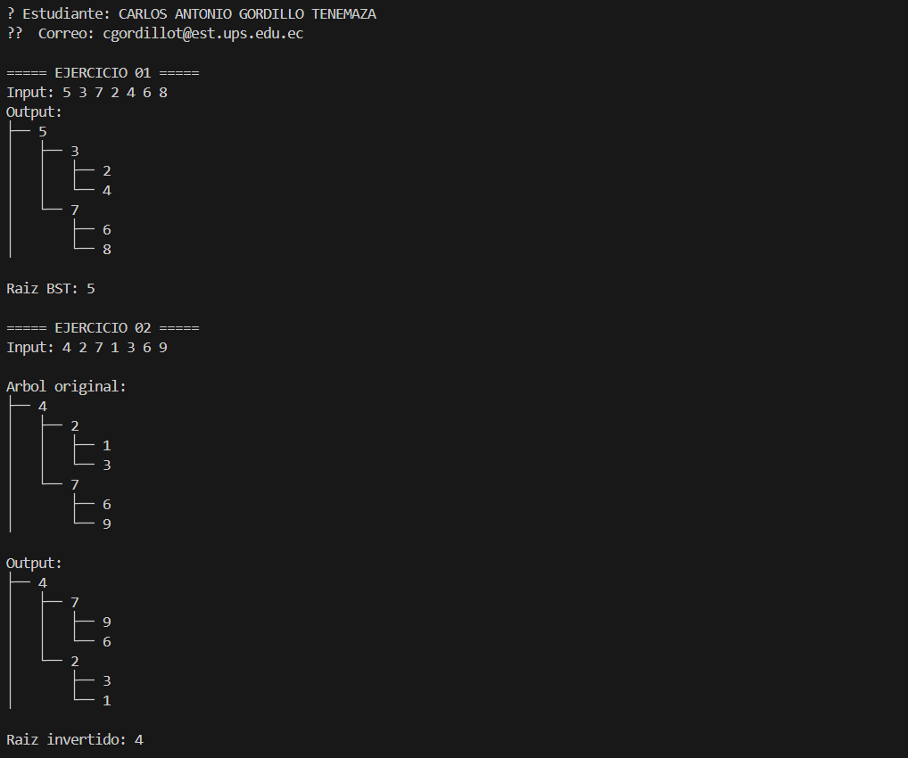
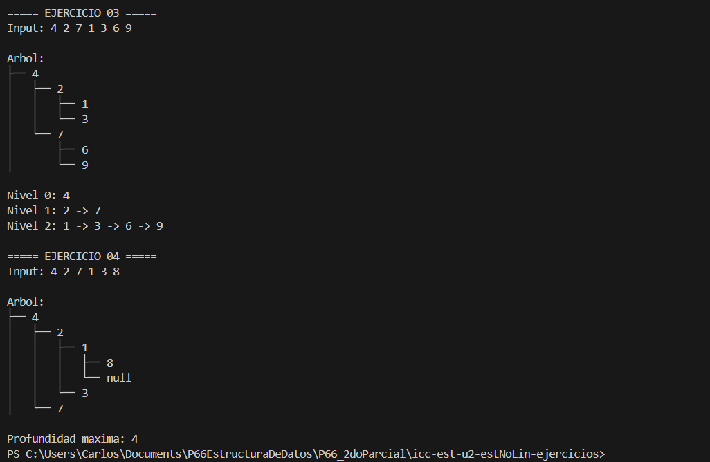

# Estructuras No Lineales – Ejercicios Árboles

Este proyecto contiene la solución a cuatro ejercicios prácticos sobre estructuras de datos tipo árbol binario, como parte del aprendizaje de estructuras no lineales en Java. Cada ejercicio se encuentra organizado en su propia carpeta, siguiendo la convención de paquetes y buenas prácticas.

---

## Identificación del Estudiante (Obligatorio)

Antes de comenzar a programar o ejecutar el proyecto, **debes completar tu nombre y correo institucional en el archivo `student.env`** que se encuentra en la raíz del proyecto. Este archivo es necesario para validar tu identidad como autor del trabajo.

### ¿Por qué es obligatorio?

Este proyecto utiliza una verificación automática que valida que has ingresado tu información personal. Si no lo haces:

- Al ejecutar el proyecto (`App.java`) verás este mensaje de error:
```
❌ Debes completar STUDENT_NAME y STUDENT_EMAIL en student.env
```
- No podrás enviar tu código (`push`) al repositorio si tienes activado el sistema de validación local.
- Las pruebas automáticas en GitHub Actions también fallarán si no detectan tu nombre y correo.

### ¿Qué debo hacer?

1. Abre el archivo `student.env` que ya está creado en el proyecto.
2. Rellena tus datos:

```
STUDENT_NAME=Tu Nombre Completo
STUDENT_EMAIL=tu.correo@institucion.edu.ec
```


3. **No borres estas líneas ni cambies los nombres de las variables.**
4. Guarda los cambios y vuelve a ejecutar el programa o hacer push.

> 💡 Este mecanismo asegura la autoría del código y que cada estudiante reciba su evaluación automática de forma personalizada.

---


## Explicación para el estudiante

```
src/
│
├── Materia/
│
├── Ejercicio_01_insert/
├── Ejercicio_02_invert/
├── Ejercicio_03_listLeves/
└── Ejercicio_04_depth/
```

---

## Descripción de Ejercicios

### Ejercicio 01: Insertar en un Árbol Binario de Búsqueda (BST)

Carpeta: `Ejercicio_01_insert`
Implementa un algoritmo para insertar nodos en un Árbol Binario de Búsqueda.

 **Input de ejemplo:** `[5, 3, 7, 2, 4, 6, 8]`
 **Output esperado:**

```
    5
  3   7
 2 4 6 8
```

---

### Ejercicio 02: Invertir un Árbol Binario

📂 Carpeta: `Ejercicio_02_invert`
Dada la raíz de un árbol binario, el algoritmo devuelve su versión invertida (espejo).

 **Input de ejemplo:**

```
    4
  2   7
1  3 6  9
```

**Output esperado:**

```
    4
  7   2
9  6 3  1
```

---

### Ejercicio 03: Listar Niveles en Listas Enlazadas

📂 Carpeta: `Ejercicio_03_listLeves`
Devuelve una lista enlazada con los nodos por nivel. Si hay N niveles, se obtienen N listas.

 **Input de ejemplo:**

```
    4
  2   7
1  3 6  9
```

**Output esperado:**

```
4  
2 → 7  
1 → 3 → 6 → 9
```

---

### Ejercicio 04: Calcular la Profundidad Máxima

Carpeta: `Ejercicio_04_depth`
Calcula la profundidad máxima de un árbol binario (la longitud del camino más largo desde la raíz hasta una hoja).

**Input de ejemplo:**

```
    4
  2   7
1  3  
8
```

**Output esperado:** `4`

---

## Indicaciones Generales

* Lee cuidadosamente el enunciado de cada ejercicio.
* Cada carpeta debe contener:

  * Código fuente Java.
  * Casos de prueba.
  * Comentarios claros.
* Realiza commit y push con el mensaje:

  ```
  Estructuras No Lineales – Ejercicios Árboles
  ```
* En el AVAC, sube la **URL del repositorio** con el código.

---

## No se calificará si:

* No hay commit con los ejercicios.
* No se incluye este README explicativo.
* Las clases o métodos no siguen los nombres requeridos.

---

## Rúbrica de Calificación

| **Criterio**       | **Descripción**                                                                       | **Puntaje** |
| ------------------ | ------------------------------------------------------------------------------------- | ----------- |
| **Informe**        | No hay informe                                                                        | 0 pts       |
|                    | Informe parcial **sin explicación** de cada método                                    | 1 pt        |
|                    | Informe parcial **con explicación** de cada método                                    | 2 pts       |
|                    | Informe completo                                                                      | 3 pts       |
| **Funcionamiento** | No implementado                                                                       | 0 pts       |
|                    | Implementado parcialmente: <br>• Ejercicio 1 y 4 → 2 pts<br>• Ejercicio 2 y 3 → 4 pts | 2–4 pts     |
|                    | Código funcional pero **no pasa todas las pruebas**                                   | 6 pts       |
|                    | Código funcional y **pasa todas las pruebas correctamente**                           | 7 pts       |


## Contribuir

Para contribuir a este proyecto, por favor crea un fork y envía una solicitud de extracción, o simplemente abre un issue con tus comentarios y sugerencias.

## Autores

- [PABLO TORRES] - Desarrollo inicial

# Informe: Árboles Binarios – Inserción, Inversión, Recorrido y Profundidad

## 📌 Información General

- **Título:** Árboles Binarios – Inserción, Inversión, Recorridos y Profundidad  
- **Asignatura:** Estructura de Datos  
- **Carrera:** Computación  
- **Estudiante:** Carlos Antonio Gordillo Tenemaza  
- **Correo institucional:** cgordillot@est.ups.edu.ec  
- **Fecha:** 06/07/2025  
- **Profesor:** Ing. Pablo Torres  

---

## 🛠️ Descripción

Este proyecto en Java resuelve 4 ejercicios prácticos sobre **árboles binarios**, que permiten aplicar los conocimientos fundamentales de estructuras no lineales.  
Las operaciones implementadas cubren:

- Inserción en Árbol Binario de Búsqueda (BST)
- Inversión de un árbol binario (modo espejo)
- Recorrido por niveles (nivel por nivel)
- Cálculo de profundidad máxima (altura del árbol)

Cada ejercicio se ejecuta desde `App.java` y está organizado en carpetas separadas.

---

## 📂 Estructura del Código

- `InsertBST.java`: inserta valores en un BST a partir de una lista de enteros.
- `InvertBinaryTree.java`: invierte un árbol binario reflejando los hijos.
- `ListLevels.java`: genera listas enlazadas para cada nivel del árbol.
- `Depth.java`: calcula la profundidad máxima del árbol (camino más largo raíz-hoja).
- `ArbolBinario.java`: permite imprimir gráficamente el árbol para facilitar la visualización.
- `App.java`: ejecuta todos los ejercicios y muestra las salidas esperadas.
- `student.env`: contiene nombre y correo del estudiante (validación automática).

---

## ✨ Funcionalidades por Ejercicio

### ✅ Ejercicio 01 – Insertar en BST

- Inserta elementos de una lista en un BST.
- Muestra la raíz del árbol creado.
- Utiliza lógica recursiva de inserción izquierda/derecha.

### ✅ Ejercicio 02 – Invertir Árbol

- Invierte un árbol binario de forma recursiva.
- El árbol original se genera desde una lista de enteros.
- Se muestra la raíz del árbol invertido.

### ✅ Ejercicio 03 – Listar Niveles

- Agrupa los nodos del árbol por niveles (nivel 0, nivel 1, ...).
- Muestra en consola la distribución de cada nivel.
- Admite cualquier estructura de árbol generada previamente.

### ✅ Ejercicio 04 – Profundidad Máxima

- Calcula la profundidad (altura) del árbol desde la raíz hasta la hoja más profunda.
- Se imprime visualmente la estructura del árbol.
- El cálculo se adapta a cualquier entrada dada por lista.

---

## 🖼️ Captura de Pantalla





---

## 🚀 Ejecución

Para compilar y ejecutar el programa:

1. Desde la carpeta raíz del proyecto, compila con:

    ```bash
    javac src/**/*.java -d bin
    ```

2. Luego ejecuta la clase principal:

    ```bash
    java -cp bin App
    ```

---

## 🧑‍💻 Ejemplo de Entrada

```plaintext
===== EJERCICIO 01 =====
Input: 5 3 7 2 4 6 8 
Output:
├── 5
│   ├── 3
│   │   ├── 2
│   │   └── 4
│   └── 7
│       ├── 6
│       └── 8

Raiz BST: 5

===== EJERCICIO 02 =====
Input: 4 2 7 1 3 6 9 

Arbol original:
├── 4
│   ├── 2
│   │   ├── 1
│   │   └── 3
│   └── 7
│       ├── 6
│       └── 9

Output:
├── 4
│   ├── 7
│   │   ├── 9
│   │   └── 6
│   └── 2
│       ├── 3
│       └── 1

Raiz invertido: 4

===== EJERCICIO 03 =====
Input: 4 2 7 1 3 6 9

Arbol:
├── 4
│   ├── 2
│   │   ├── 1
│   │   └── 3
│   └── 7
│       ├── 6
│       └── 9

Nivel 0: 4
Nivel 1: 2 -> 7
Nivel 2: 1 -> 3 -> 6 -> 9

===== EJERCICIO 04 =====
Input: 4 2 7 1 3 8

Arbol:
├── 4
│   ├── 2
│   │   ├── 1
│   │   │   ├── 8
│   │   │   └── null
│   │   └── 3
│   └── 7

Profundidad maxima: 4